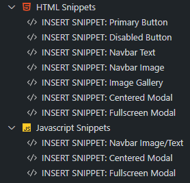
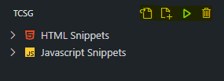

# TCSG (Tailwind Components Snippet Generator)

TCSG is a Visual Studio Code extension designed to streamline the development workflow for Tailwind CSS projects. This extension provides ready to go component snippets easily customizable within the Tailwind CSS framework. 

## Features

**Snippet Insertion**: Quickly insert pre-defined Tailwind CSS component snippets from the click of a button, or the snippet prefix, into your HTML and JavaScript files, improving your development speed and consistency. The components included are:
- Button (Primary, Disabled)
- Navbar (Text based, Image based)
- Image gallery
- Modal (Viewport centered, Fullscreen)
- More coming soon...

**Build Tailwind CSS**: Compile your Tailwind CSS using a custom build command that respects your project's specific configuration, directly from within VSCode.

## How to use

**Snippet Insertion**:
1. Open the TCSG Snippets view on the left panel.
2. In a JavaScript or HTML file, insert the snippets by selecting the desired one inside the Tree View. For example, if I wanted to insert a centered modal component, I should follow the next steps:
    - In my HTML file, click on the HTML Snippets dropdown, and select the "Centered Modal" option.
    - In my JavaScript file, click on the Javascript Snippets dropdown, and select the "Centered Modal" option.
    - Keep in mind you have to include both of these files inside the source files for your Tailwind CSS configuration files.

    
3. With these steps, you have correctly inserted the "Centered Modal" component.

**Build Tailwind CSS**:
1. To build Tailwind CSS, I assume you already know how to install Tailwind CSS for your project, if not, check their documentation about it: [Tailwind Installation Docs](https://tailwindcss.com/docs/installation)
2. Now that you installed Tailwind CSS for your project, open the TCSG Snippets view on the left panel.
3. Inside your project's folder, follow the next steps:
    - Select your input and output files by clicking on the "Select I/O Files" icon (the first in the following image).
    - Now that the I/O Tailwind CSS files are selected, click on the "Build" icon (the second in the following image).

    
4. If, for some reason, you want to change the I/O files for your current project, click on the "Clear I/O Files" icon (the third icon in the last image). Then you can set them again using the "Select I/O Files" icon.

## Release Notes

### 1.0.0

Initial release

## License

Distributed under the MIT License. See LICENSE for more information.
